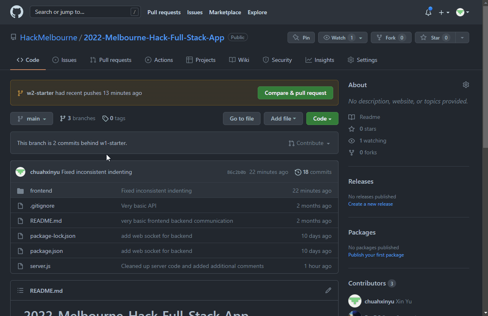

# 👋 Workshop 2: HTML, CSS & ReactJS

## Setup
1. Text Editor
   * VSCode: https://code.visualstudio.com/download
   * IntelliJ, Atom, Brackets, etc.
2. node.js
   * https://nodejs.org/en/download/
3. npm
   * https://docs.npmjs.com/downloading-and-installing-node-js-and-npm
---
## Download the starter `.zip` file
> * the starter code contains the socketIO server created from Workshop 1
> * you don't have to download/clone the starter if you have completed Workshop 1

1. make sure that you're in the `w2-starter` branch
2. then click on the green *Code* button and click on the *Download ZIP* option
3. unzip the `.zip` file and open the unzipped file in VSCode (or whatever code editor you are using)

* If you have git installed on your system, you could clone the repository instead of downloading the `.zip` file
  1. `cd`/navigate into the directory you want to put the project in
  2. `git clone <HTTPS url>`
---
## Resources
* Google Slides: https://docs.google.com/presentation/d/1mcsyXLTl6iLl8t_JkM9C6OMQiP9n2qvgu6ZwHLEhhW4/edit?usp=sharing
* Lightbulb Codepen Example: https://codepen.io/chuahxinyu/pen/KKZbgqa
---
## Additional Resources
> More resources can be found in the [Resources Guide](https://www.notion.so/Resource-guide-42174ef4d8cf4271919f6cab4d8d75c3) in the Participant's Handbook
* SocketIO: https://socket.io/
* HTML Documentation [https://devdocs.io/html/](https://devdocs.io/html/)
* CSS Documentation  [https://devdocs.io/css/](https://devdocs.io/css/)
* W3Schools [https://www.w3schools.com/](https://www.w3schools.com/)
* W3Schools Web Development Roadmap [https://www.w3schools.com/whatis/](https://www.w3schools.com/whatis/)
* GeeksforGeeks Web Development [https://www.geeksforgeeks.org/web-development/?ref=shm](https://www.geeksforgeeks.org/web-development/?ref=shm)
* MDN Web Docs [https://developer.mozilla.org/en-US/](https://developer.mozilla.org/en-US/)

> 🔥 Have fun @ Melbourne Hack 2022! 🔥
